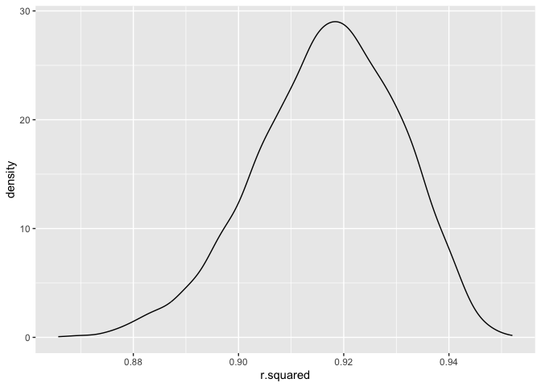
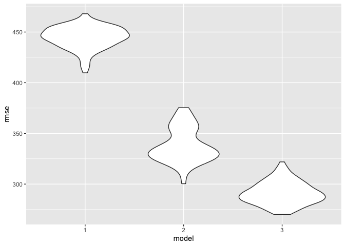

p8105_hw6_qc2336
================
Qiran Chen
2023-11-28

## Problem 1

``` r
homicide=read_csv("./data/homicide-data.csv")|>
  mutate(city_state=str_c(city,state,sep=", "))|>
  mutate(victim_age=as.numeric(victim_age),
          resolved= case_when(
      disposition == "Closed without arrest" ~ 0,
      disposition == "Open/No arrest"        ~ 0,
      disposition == "Closed by arrest"    ~ 1))|>
  filter(city_state !=c("Dallas, TX", "Phoenix, AZ","Kansas City, MO"))|>
        filter(city_state !="Tulsa, AL")|>
        filter(victim_race %in% c("White", "Black"))|>
  select(city_state, resolved, victim_age, victim_race, victim_sex)|>
    drop_na()
```

    ## Rows: 52179 Columns: 12
    ## ── Column specification ────────────────────────────────────────────────────────
    ## Delimiter: ","
    ## chr (9): uid, victim_last, victim_first, victim_race, victim_age, victim_sex...
    ## dbl (3): reported_date, lat, lon
    ## 
    ## ℹ Use `spec()` to retrieve the full column specification for this data.
    ## ℹ Specify the column types or set `show_col_types = FALSE` to quiet this message.

    ## Warning: There was 1 warning in `mutate()`.
    ## ℹ In argument: `victim_age = as.numeric(victim_age)`.
    ## Caused by warning:
    ## ! NAs introduced by coercion

``` r
case_baltimore=homicide|>
  filter(city_state %in% "Baltimore, MD")
glm(resolved~ victim_age + victim_race + victim_sex,
    data = case_baltimore,
    family = binomial())|>
  broom::tidy()|>
  mutate(OR = exp(estimate),
         OR_lower = exp(estimate - 1.96*std.error),
         OR_upper = exp(estimate + 1.96*std.error) ) |>
  filter(term %in% c('victim_sexMale')) |>
  select(estimate, OR,OR_lower,OR_upper) 
```

    ## # A tibble: 1 × 4
    ##   estimate    OR OR_lower OR_upper
    ##      <dbl> <dbl>    <dbl>    <dbl>
    ## 1   -0.854 0.426    0.325    0.558

``` r
case_all=homicide|>
  group_by(city_state)|>
  nest() |>
  mutate(
    model = map(data, ~ glm(resolved ~ victim_age + victim_sex + victim_race, data = .x, family = binomial())),
    tidy_results = map(model, broom::tidy),
    filtered_results = map(tidy_results, ~ filter(.x, term == "victim_sexMale"))
  ) |>
  unnest(filtered_results) |>
  mutate(OR = exp(estimate),
         OR_lower = exp(estimate - 1.96*std.error),
         OR_upper = exp(estimate + 1.96*std.error))|>
  select(city_state, OR, OR_lower, OR_upper)

case_all
```

    ## # A tibble: 47 × 4
    ## # Groups:   city_state [47]
    ##    city_state         OR OR_lower OR_upper
    ##    <chr>           <dbl>    <dbl>    <dbl>
    ##  1 Albuquerque, NM 1.77     0.831    3.76 
    ##  2 Atlanta, GA     1.00     0.684    1.46 
    ##  3 Baltimore, MD   0.426    0.325    0.558
    ##  4 Baton Rouge, LA 0.381    0.209    0.695
    ##  5 Birmingham, AL  0.870    0.574    1.32 
    ##  6 Boston, MA      0.674    0.356    1.28 
    ##  7 Buffalo, NY     0.521    0.290    0.935
    ##  8 Charlotte, NC   0.884    0.557    1.40 
    ##  9 Chicago, IL     0.410    0.336    0.501
    ## 10 Cincinnati, OH  0.400    0.236    0.677
    ## # ℹ 37 more rows

``` r
case_all|>
  ggplot(aes(x=city_state,y=OR))+
  geom_point()+
  geom_errorbar(aes(ymin=OR_lower,ymax=OR_upper))+
  theme(axis.text.x = element_text(angle = 90, vjust = 0.5, hjust = 1))
```

<!-- -->

## Problem 2

``` r
weather_df = 
  rnoaa::meteo_pull_monitors(
    c("USW00094728"),
    var = c("PRCP", "TMIN", "TMAX"), 
    date_min = "2022-01-01",
    date_max = "2022-12-31") |>
  mutate(
    name = recode(id, USW00094728 = "CentralPark_NY"),
    tmin = tmin / 10,
    tmax = tmax / 10) |>
  select(name, id, everything())
```

    ## using cached file: /Users/qiranchen/Library/Caches/org.R-project.R/R/rnoaa/noaa_ghcnd/USW00094728.dly

    ## date created (size, mb): 2023-11-29 12:13:30.286205 (8.544)

    ## file min/max dates: 1869-01-01 / 2023-11-30

``` r
lm(tmax~ tmin+prcp, data=weather_df)
```

    ## 
    ## Call:
    ## lm(formula = tmax ~ tmin + prcp, data = weather_df)
    ## 
    ## Coefficients:
    ## (Intercept)         tmin         prcp  
    ##    8.042803     1.013386    -0.001541

``` r
bootstrap_rsquare = 
  weather_df |> 
  bootstrap(5000) |>
  mutate(fit = map(.x = strap, ~lm(tmax ~ tmin+prcp, data = .x))) |>
    mutate(rsquare = map(fit, broom::glance))|>
  unnest(rsquare, names_sep = NULL)|>
  select(.id, r.squared)
```

``` r
bootstrap_rsquare|>
  ggplot(aes(x = r.squared)) + geom_density()
```

<!-- -->

``` r
bootstrap_rsquare|>
  summarize(r_squared_lower = quantile(r.squared, 0.025),
  r_squared_upper = quantile(r.squared, 0.975))
```

    ## # A tibble: 1 × 2
    ##   r_squared_lower r_squared_upper
    ##             <dbl>           <dbl>
    ## 1           0.888           0.941

``` r
bootstraps_log = 
  weather_df |> 
  bootstrap(5000) |>
  mutate(fit = map(.x = strap, ~lm(tmax ~ tmin+prcp, data = .x))) |>
  mutate(logvalue = map(fit, broom::tidy))|>
    unnest(logvalue) |>
    select(.id,term,estimate)|>
  pivot_wider(
    names_from = term,
    values_from = estimate) |>
  rename(
    beta_0 = `(Intercept)`,
    beta_1 = tmin) |>
  mutate(log_b0xb1 = log(beta_0*beta_1)) |>
  select( log_b0xb1)

bootstraps_log|>
    ggplot(aes(x = log_b0xb1)) +
    geom_density()
```

<!-- -->

``` r
bootstraps_log|>
  summarize(log_lower = quantile(log_b0xb1, 0.025),
  log_upper = quantile(log_b0xb1, 0.975))
```

    ## # A tibble: 1 × 2
    ##   log_lower log_upper
    ##       <dbl>     <dbl>
    ## 1      2.06      2.14

## Problem 3

``` r
birthweight=read_csv("./data/birthweight.csv")
```

    ## Rows: 4342 Columns: 20
    ## ── Column specification ────────────────────────────────────────────────────────
    ## Delimiter: ","
    ## dbl (20): babysex, bhead, blength, bwt, delwt, fincome, frace, gaweeks, malf...
    ## 
    ## ℹ Use `spec()` to retrieve the full column specification for this data.
    ## ℹ Specify the column types or set `show_col_types = FALSE` to quiet this message.

``` r
head(birthweight)
```

    ## # A tibble: 6 × 20
    ##   babysex bhead blength   bwt delwt fincome frace gaweeks malform menarche
    ##     <dbl> <dbl>   <dbl> <dbl> <dbl>   <dbl> <dbl>   <dbl>   <dbl>    <dbl>
    ## 1       2    34      51  3629   177      35     1    39.9       0       13
    ## 2       1    34      48  3062   156      65     2    25.9       0       14
    ## 3       2    36      50  3345   148      85     1    39.9       0       12
    ## 4       1    34      52  3062   157      55     1    40         0       14
    ## 5       2    34      52  3374   156       5     1    41.6       0       13
    ## 6       1    33      52  3374   129      55     1    40.7       0       12
    ## # ℹ 10 more variables: mheight <dbl>, momage <dbl>, mrace <dbl>, parity <dbl>,
    ## #   pnumlbw <dbl>, pnumsga <dbl>, ppbmi <dbl>, ppwt <dbl>, smoken <dbl>,
    ## #   wtgain <dbl>

``` r
birthweight=birthweight|>
  mutate(malform=factor(malform),
         mrace=factor(mrace),
         frace=factor(frace),
         babysex=factor(babysex))|>
  drop_na()


birthweight
```

    ## # A tibble: 4,342 × 20
    ##    babysex bhead blength   bwt delwt fincome frace gaweeks malform menarche
    ##    <fct>   <dbl>   <dbl> <dbl> <dbl>   <dbl> <fct>   <dbl> <fct>      <dbl>
    ##  1 2          34      51  3629   177      35 1        39.9 0             13
    ##  2 1          34      48  3062   156      65 2        25.9 0             14
    ##  3 2          36      50  3345   148      85 1        39.9 0             12
    ##  4 1          34      52  3062   157      55 1        40   0             14
    ##  5 2          34      52  3374   156       5 1        41.6 0             13
    ##  6 1          33      52  3374   129      55 1        40.7 0             12
    ##  7 2          33      46  2523   126      96 2        40.3 0             14
    ##  8 2          33      49  2778   140       5 1        37.4 0             12
    ##  9 1          36      52  3515   146      85 1        40.3 0             11
    ## 10 1          33      50  3459   169      75 2        40.7 0             12
    ## # ℹ 4,332 more rows
    ## # ℹ 10 more variables: mheight <dbl>, momage <dbl>, mrace <fct>, parity <dbl>,
    ## #   pnumlbw <dbl>, pnumsga <dbl>, ppbmi <dbl>, ppwt <dbl>, smoken <dbl>,
    ## #   wtgain <dbl>

``` r
model1=lm(bwt ~gaweeks+malform+smoken+mrace, data = birthweight)
  
  
broom::tidy(model1)
```

    ## # A tibble: 7 × 5
    ##   term        estimate std.error statistic   p.value
    ##   <chr>          <dbl>     <dbl>     <dbl>     <dbl>
    ## 1 (Intercept)    944.     88.1     10.7    1.69e- 26
    ## 2 gaweeks         59.7     2.18    27.4    3.69e-152
    ## 3 malform1        11.3   115.       0.0983 9.22e-  1
    ## 4 smoken         -10.9     0.945  -11.5    2.58e- 30
    ## 5 mrace2        -286.     14.7    -19.4    8.26e- 81
    ## 6 mrace3        -178.     68.8     -2.59   9.76e-  3
    ## 7 mrace4        -192.     30.4     -6.34   2.60e- 10

``` r
birthweight|>
  add_predictions(model1)|> 
  add_residuals(model1)|>
  ggplot(aes(x=pred,y=resid))+geom_point()
```

<!-- -->

``` r
cv = 
  crossv_mc(birthweight, 100) |>
  mutate(
    train = map(train, as_tibble), 
    test = map(test, as_tibble))
```

``` r
cv=cv|>
  mutate(
    model_1 = map(train, ~lm(bwt ~gaweeks+malform+smoken+mrace, data = birthweight), data = .x),
    model_2  = map(train, ~lm(bwt ~ gaweeks + blength, data = .x)),
    model_3  = map(train, ~lm(bwt ~ bhead*blength*babysex, data = .x))) |>
  mutate(
    rmse_1 = map2_dbl(model_1, test, ~rmse(model = .x, data = .y)),
    rmse_2 = map2_dbl(model_2, test, ~rmse(model = .x, data = .y)),
    rmse_3 = map2_dbl(model_3, test, ~rmse(model = .x, data = .y)))

cv |> 
  select(starts_with("rmse")) |> 
  pivot_longer(
    everything(),
    names_to = "model", 
    values_to = "rmse",
    names_prefix = "rmse_") |> 
  mutate(model = fct_inorder(model)) |> 
  ggplot(aes(x = model, y = rmse)) + geom_violin()
```

<!-- -->
\>\> From the model, model 3 is the best, since it has the lowest rmse.
